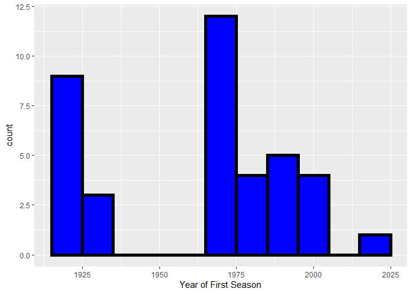

ST558 Project1
================
Xinyu Hu
6/12/2020

# Before Everything

This is a project that go through the pipeline from extracting data from
public API, to processing in the RStudio, and to upload directly to the
Github as README. Data was in JSON format when imported, which provides
a great learning opportunity for JSON files; The output was directly
push to the Github, which is also a great practice of what we learned in
the class. It’s an interesting and steep learning curve, and I love it
quite a bit.

# Describe JSON

## What is Jason data?

Based on Wikipedia, [JSON (Jave Script Object
Notation)](https://en.wikipedia.org/wiki/JSON) is an open standard
lightweight file format for data interchange. It uses human-readable
text to store and transmit data objects. It is a very common data
format, with a diverse range of applications.Data that follows JSON
format is JSON data.

## Where does it get used?

According to
[tutorialspoint](https://www.tutorialspoint.com/json/json_quick_guide.htm#:~:text=JSON%20format%20is%20used%20for,used%20with%20modern%20programming%20languages.),
it is used while writing JavaScript based applications that includes
browser extensions and websites. For example,transmit data between a
server and web applications;Web services and APIs use JSON format to
provide public data;serializing and transmitting structured data over
network connection;used with modern programming languages.

## Why it is a good way to store data?

Firstly, it is light-weighted. So before JSON, web services used XML as
primary data format for transmitting, but after JSON appeard, it became
the preferred formate. Secondly, JSON is easier for both humans and
machines to understand, since its syntax is minimal and its structure is
predictable. JSON was meant to carry structured information between
programs from the very beginning. Plus, the nature of “human readable”
also play a strong role that make JSON a good way to store data, which
makes JSON not as confusing as XML. For more detail, feel free to check
out [The Rise and Rise of
JSON](https://twobithistory.org/2017/09/21/the-rise-and-rise-of-json.html)
and [JSON.ORG](https://www.json.org/json-en.html).

# Discuss JSON R-Packages

There are 3 packages in R that work with JSON file. They are
[rjson](https://cran.r-project.org/web/packages/rjson/rjson.pdf),
[jsonlite](https://cran.r-project.org/web/packages/jsonlite/jsonlite.pdf)
and
[RJSONIO](https://cran.r-project.org/web/packages/RJSONIO/RJSONIO.pdf).
Also, there are package like
[tidyjson](https://cran.r-project.org/web/packages/tidyjson/vignettes/introduction-to-tidyjson.html)
that also can serve similar functionality. `rjsonio` allows R objects to
be inserted into Javascript/ECMAScript/ActionScript code and allows R
programmers to read and convert JSON content to R objects. `rjson`’s
performance is now similar to this package, and perhaps slightly faster
in some cases. `jsonlite` Started out as a fork of `rjsonio`, but has
been completely rewritten in recent versions. The package offers
flexible, robust, high performance tools for working with JSON in R and
is particularly powerful for building pipelines and interacting with a
web API.

For this project, I choose `jsonlite` as it is the most familiar JSON
package to me. Also, its fast speed is appealing.

# Read-in JSON data

This is my step by step process to load in data from [NHL Franchise
API](https://gitlab.com/dword4/nhlapi/-/blob/master/records-api.md).  
Step1: Load library

``` r
library("httr")
library("jsonlite")
```

Step2: Prepare Parent URL

``` r
full_url <- "https://records.nhl.com/site/api"
```

Step3: Obtain Franchise data

``` r
franchise <- fromJSON(paste(full_url,"/franchise",sep=""))
franchise <- franchise[[1]]
```

Step4: Obtain Franchise team
totals

``` r
franchise_team_totals <- fromJSON(paste(full_url,"/franchise-team-totals",sep=""))
franchise_team_totals <- franchise_team_totals[[1]]
```

Step5: Get the season record, goalie record and skater record for
Franchise 1. Using this step, we can obtain the data columns from those
3 tables provided by the
API.

``` r
season_records_all <- fromJSON(paste(full_url,"/franchise-season-records?cayenneExp=franchiseId=1",sep=""))
season_records_all <- season_records_all[[1]]

goalie_records_all <- fromJSON(paste(full_url,"/franchise-goalie-records?cayenneExp=franchiseId=1",sep=""))
goalie_records_all <- goalie_records_all[[1]]

skater_records_all <- fromJSON(paste(full_url,"/franchise-skater-records?cayenneExp=franchiseId=1",sep=""))
skater_records_all <- skater_records_all[[1]]
```

Step6: loop through all the franchise (2 to 38), to obtain the season
record, goalie record and skater record.

``` r
for (i in 2:38){
  # extract data from api
  season_records <- fromJSON(paste(full_url,"/franchise-season-records?cayenneExp=franchiseId=",i,sep=""))
  season_records <- season_records[[1]]
  
  goalie_records <- fromJSON(paste(full_url,"/franchise-goalie-records?cayenneExp=franchiseId=",i,sep=""))
  goalie_records <- goalie_records[[1]]
  
  skater_records <- fromJSON(paste(full_url,"/franchise-skater-records?cayenneExp=franchiseId=",i,sep=""))
  skater_records <- skater_records[[1]]
  
  # append to the giant table
  season_records_all <-rbind(season_records_all,season_records)
  goalie_records_all <-rbind(goalie_records_all,goalie_records)
  skater_records_all <-rbind(skater_records_all,skater_records)
  
  # remove temporary table after appending
  rm(season_records,goalie_records,skater_records) 
}
```

Step7: Check the data we read (first 5 columns, first 5 rows).

``` r
head(franchise[,1:5],n=5)
```

    ##   id firstSeasonId lastSeasonId mostRecentTeamId teamCommonName
    ## 1  1      19171918           NA                8      Canadiens
    ## 2  2      19171918     19171918               41      Wanderers
    ## 3  3      19171918     19341935               45         Eagles
    ## 4  4      19191920     19241925               37         Tigers
    ## 5  5      19171918           NA               10    Maple Leafs

``` r
head(franchise_team_totals[,1:5],n=5)
```

    ##   id activeFranchise firstSeasonId franchiseId gameTypeId
    ## 1  1               1      19821983          23          2
    ## 2  2               1      19821983          23          3
    ## 3  3               1      19721973          22          2
    ## 4  4               1      19721973          22          3
    ## 5  5               1      19261927          10          2

``` r
head(season_records_all[,1:5],n=5)
```

    ##   id fewestGoals fewestGoalsAgainst fewestGoalsAgainstSeasons
    ## 1  8         155                131              1955-56 (70)
    ## 2 41          NA                 NA                      <NA>
    ## 3 36          NA                 NA                      <NA>
    ## 4 37          NA                 NA                      <NA>
    ## 5 10         147                131              1953-54 (70)
    ##   fewestGoalsSeasons
    ## 1       1952-53 (70)
    ## 2               <NA>
    ## 3               <NA>
    ## 4               <NA>
    ## 5       1954-55 (70)

``` r
head(goalie_records_all[,1:5],n=5)
```

    ##    id activePlayer firstName franchiseId      franchiseName
    ## 1 261        FALSE   Patrick           1 Montréal Canadiens
    ## 2 294         TRUE     Carey           1 Montréal Canadiens
    ## 3 296        FALSE   Jacques           1 Montréal Canadiens
    ## 4 327        FALSE    George           1 Montréal Canadiens
    ## 5 414        FALSE  Stephane           1 Montréal Canadiens

``` r
head(skater_records_all[,1:5],n=5)
```

    ##      id activePlayer assists firstName franchiseId
    ## 1 16891        FALSE     712      Jean           1
    ## 2 16911        FALSE     688     Henri           1
    ## 3 16990        FALSE     422   Maurice           1
    ## 4 17000        FALSE     728       Guy           1
    ## 5 17025        FALSE      87     Chris           1

# Exploratory Analysis

## Load Packages

Lots of packages are used in the analysis section. `ggplot2` is a
package with a spectrume of data visualization charts. It is very
versatile and helpful. `dplyr`, `tidyr` and `tidyverse` are packages
super helpful for data manipulation. And `DT` are used to create
user-friendly data table in the output.

## Franchise Table Analysis

There is not so much information provided by the francise table. A very
interesting point is to look at when is the first season for each
franchise. In order to do so, I used `substr` function to get the first
4 digits, which is the year of first half. Then we plot the first year
in a
histogram.

``` r
franchise$firstSeasonId_New <- as.numeric(substr(franchise$firstSeasonId,1,4))

FirstSeason_plot<-ggplot(data=franchise,aes(x=firstSeasonId_New))
FirstSeason_plot + geom_histogram(binwidth = 10, color="black", fill="blue", size=2)+
  labs(x = "Year of First Season")
```

<!-- --> I found that
there are 2 time in the history that lots of franchises are created. One
is between 1915 and 1925, during which 9 franchises were createed;
Another time is between 1965 and 1975, totally 12 franchises were
created then. After 1975, there remains a stream of Franchise creation,
but not as many as those 2 peak time.

## Franchise Team Totals Analysis

This table offer a wide varitey of record about each franchise, by game
type. In order to understand the winning rate for home and road games,
several new variables are created. To be exact, Game Count and Win Rate
are created at Overall, Home and Road
levels.

``` r
franchise_team_totals['Overall_Game_Count'] <- rowSums(franchise_team_totals[,c("wins","losses","ties")],na.rm = T)
franchise_team_totals['Overall_Win_Rate'] <- round(franchise_team_totals$wins/franchise_team_totals$Overall_Game_Count,2)
franchise_team_totals['Home_Game_Count'] <- rowSums(franchise_team_totals[,c("homeWins","homeLosses","homeTies")],na.rm = T)
franchise_team_totals['Home_Win_Rate'] <- round(franchise_team_totals$homeWins/franchise_team_totals$Home_Game_Count,2)
franchise_team_totals['Road_Game_Count'] <- rowSums(franchise_team_totals[,c("roadWins","roadLosses","roadTies")],na.rm = T)
franchise_team_totals['Road_Win_Rate'] <- round(franchise_team_totals$roadWins/franchise_team_totals$Road_Game_Count,2)
```

With all those variables created, I create a table with only interesting
metrics and sort them by franchise ID and game type
ID.

``` r
franchise_team_SimpTotals <- franchise_team_totals %>% select(franchiseId,gameTypeId,Overall_Game_Count,Overall_Win_Rate,
                                                              Home_Game_Count,Home_Win_Rate,Road_Game_Count,Road_Win_Rate)%>% 
                                                    arrange(franchiseId,gameTypeId)
```

Using the `datatable` function from `DT` package, I make a user-friendly
datatable.

``` r
datatable(franchise_team_SimpTotals,rownames = FALSE)
```

<!-- -->

This is a table that capture win rate for different senarios. Though not
so much insight could be derived from this table, it serves as good
source of data for further interests.

## Season Record Analysis

Season record table provide lots of info related to seasonal performance
of each franchise. The first step I would take is, to get some basic
summary about win and loss streaks at home and at road. (I exclude
*Montreal Wanderers* as its data contains numerous
missing)

``` r
subtable<-round(apply(season_records_all[season_records_all$franchiseName!="Montreal Wanderers",c("homeWinStreak","homeLossStreak","roadWinStreak","roadLossStreak")],MARGIN=2,summary),2)
kable(subtable[ ,1:4])  
```

|         | homeWinStreak | homeLossStreak | roadWinStreak | roadLossStreak |
| ------- | ------------: | -------------: | ------------: | -------------: |
| Min.    |             5 |           5.00 |          3.00 |           4.00 |
| 1st Qu. |             9 |           6.00 |          6.00 |           8.00 |
| Median  |            11 |           7.00 |          8.00 |          11.00 |
| Mean    |            11 |           7.59 |          7.43 |          12.76 |
| 3rd Qu. |            13 |           9.00 |          9.00 |          14.00 |
| Max.    |            23 |          14.00 |         12.00 |          38.00 |

Here I find that the average home loss streak (7.59) and road win streak
(7.43) is very close. This makes sense because One franchise’s home loss
will be the counterpart’s raod win. The similarity also exist when
compare average home win streak and road loss streak.

One step further, I am curious teams whose road loss streak less than 12
will have different home win streak distribution. So first, I created a
character variable named `roadLossStreak_Category`, assigning values
depending one if the road loss streak is less than 12. Then create a
side-by-side histogram to compare the home win
streak.

``` r
season_records_all["roadLossStreak_Category"] <- ifelse(season_records_all$roadLossStreak <12, "Less than 12","No Less than 12")

WinLossStreak_plot<-ggplot(data=season_records_all,aes(x=homeWinStreak))
WinLossStreak_plot + geom_histogram(binwidth = 1,color="black", fill="blue", size=2)+
                     labs(x = "Home Win Streak")+
  facet_grid(cols=vars(roadLossStreak_Category))
```

<!-- -->

With limited number of franchise, both distributions look robust. But
based on this table, I think the home win streak of franchiases with
Less than 12 road loss streak (left histogram) are centering aroud 9,
while the “No Less than 12” group (right histogram) are centered at 11.
Also, the left histogram looks more bell-shaped, while the right one’s
peak are right at 5 and skewed to the right.

## Goalie Analysis

Goalie table from the API returns information about each goalie. It
includes both active and non-active goalies. Basically, I am interested
in how many active and non active player each franchise has. So I
created a contingency table using the code below.*(firstly, I reassign
value of activePlayer variable to be more reader
friendly)*

``` r
goalie_records_all$activePlayer <- ifelse(goalie_records_all$activePlayer=="TRUE",'Active Goalie','Non-Active Goalie')
goalie_records_all%>%
  group_by(franchiseId, activePlayer)%>%
  summarise(n=n())%>%
  spread(activePlayer, n)%>%
  kable()
```

| franchiseId | Active Goalie | Non-Active Goalie |
| ----------: | ------------: | ----------------: |
|           1 |             2 |                35 |
|           2 |            NA |                 1 |
|           3 |            NA |                 4 |
|           4 |            NA |                 3 |
|           5 |             7 |                46 |
|           6 |             2 |                49 |
|           7 |            NA |                 6 |
|           8 |            NA |                11 |
|           9 |            NA |                 4 |
|          10 |             3 |                39 |
|          11 |             5 |                43 |
|          12 |             3 |                45 |
|          13 |            NA |                 5 |
|          14 |             4 |                39 |
|          15 |             3 |                34 |
|          16 |             4 |                30 |
|          17 |             5 |                32 |
|          18 |             6 |                36 |
|          19 |             4 |                27 |
|          20 |             5 |                34 |
|          21 |             3 |                32 |
|          22 |             4 |                26 |
|          23 |             3 |                24 |
|          24 |             3 |                27 |
|          25 |             4 |                39 |
|          26 |             6 |                32 |
|          27 |             8 |                26 |
|          28 |             8 |                37 |
|          29 |             3 |                16 |
|          30 |             6 |                21 |
|          31 |             4 |                29 |
|          32 |             7 |                19 |
|          33 |             4 |                25 |
|          34 |             3 |                 7 |
|          35 |             3 |                14 |
|          36 |             2 |                14 |
|          37 |             3 |                11 |
|          38 |             7 |                NA |

I am very interested to learn goalie’s most win by franchise and active
status. So I created a side-by-side box plot as
below.

``` r
goalie_records_all$franchiseId <- as.factor(goalie_records_all$franchiseId)
goalie_records_plot<-ggplot(goalie_records_all,aes(x=franchiseId,y=mostWinsOneSeason))
goalie_records_plot + geom_boxplot()+
  facet_grid(rows =vars(goalie_records_all$activePlayer))+
  labs(title="Box-Plot: Seasonal Most Win By Goalie Type")
```

<!-- -->

Comparing active goalie vs non-active goalie, there isn’t so much
insight to obtain visually from this plot. The only trend I can observe
is, the active goalie are higher in *most win one season* in terms of
averages than non-active goalie in most teams. When we focus on
franchise vs franchise, I do see a difference in distribution of *most
win one season*. While most are right tailed, some franchise have
average *most win one season* being around 5 (franchise 25 for example),
and others being around 15 (franchise 12 for example).

# Skater Record Analysis

Skater Record table is a table that provides abundant info about
skaters. Just like Goalie, I’m interested in how many active and
non-active each of the franchise has right now. So I create a contigency
table to do the count. *(firstly, I reassign value of activePlayer
variable to be more reader
friendly)*

``` r
skater_records_all$activePlayer <- ifelse(skater_records_all$activePlayer=="TRUE",'Active Skater','Non-Active Skater')
skater_records_all$activePlayer <- as.factor(skater_records_all$activePlayer)
skater_records_all$mostPointsOneGame <- as.numeric(skater_records_all$mostPointsOneGame)
skater_records_all%>%group_by(franchiseName, activePlayer)%>%
                    summarise(n=n())%>%
          spread(activePlayer, n)%>%
                    kable()
```

| franchiseName         | Active Skater | Non-Active Skater |
| :-------------------- | ------------: | ----------------: |
| Anaheim Ducks         |            74 |               294 |
| Arizona Coyotes       |            58 |               476 |
| Boston Bruins         |            74 |               836 |
| Brooklyn Americans    |            NA |               141 |
| Buffalo Sabres        |            73 |               387 |
| Calgary Flames        |            57 |               497 |
| Carolina Hurricanes   |            60 |               418 |
| Chicago Blackhawks    |            69 |               795 |
| Cleveland Barons      |            NA |               140 |
| Colorado Avalanche    |            63 |               430 |
| Columbus Blue Jackets |            70 |               194 |
| Dallas Stars          |            62 |               553 |
| Detroit Red Wings     |            57 |               796 |
| Edmonton Oilers       |            65 |               444 |
| Florida Panthers      |            59 |               303 |
| Hamilton Tigers       |            NA |                36 |
| Los Angeles Kings     |            61 |               535 |
| Minnesota Wild        |            56 |               188 |
| Montréal Canadiens    |            64 |               724 |
| Montreal Maroons      |            NA |                78 |
| Montreal Wanderers    |            NA |                11 |
| Nashville Predators   |            59 |               211 |
| New Jersey Devils     |            63 |               456 |
| New York Islanders    |            54 |               455 |
| New York Rangers      |            64 |               919 |
| Ottawa Senators       |            74 |               272 |
| Philadelphia Flyers   |            58 |               517 |
| Philadelphia Quakers  |            NA |                38 |
| Pittsburgh Penguins   |            77 |               582 |
| San Jose Sharks       |            53 |               267 |
| St. Louis Blues       |            55 |               551 |
| St. Louis Eagles      |            NA |                90 |
| Tampa Bay Lightning   |            51 |               315 |
| Toronto Maple Leafs   |            69 |               832 |
| Vancouver Canucks     |            61 |               500 |
| Vegas Golden Knights  |            43 |                 4 |
| Washington Capitals   |            52 |               457 |
| Winnipeg Jets         |            59 |               215 |

Lastly, I am interesed in the relationship between Most Assists One
Season and Most Goal One Season for each of the skater. Especially, I
want to know how *most point one game* can influence on the
relationship. So I make a scatter plot, with color to indicate *most
point one game*. The color theme comes from `wesanderson` package.

``` r
library(wesanderson)
skater_records_plot<- ggplot(skater_records_all,aes(x=mostAssistsOneSeason, y=mostGoalsOneSeason, color=mostPointsOneGame)) 
skater_records_plot + geom_point()+scale_color_gradientn(colours = rainbow(8))
```

<!-- -->

There are so many observation can be made by this plot. First, we do see
that as *most points one game* increase from orange to purple, the data
points are moving from the bottom left to the top right. This suggests a
positive correlation among *most points one game*, *most goal one
season* and *most assist one season*. This finding verifies that the
best skater can be doing well in all aspects. Second finding is, as
*most points one game* increases, the data points are scatter in a wider
zone. For example, for those orange dots, it all nested ina 5 by 5 zone,
while for green dots, the zone is from 5 to 50 horizontally, and 5 to 45
vertically. Thirdly, the slop looks very different as *most points one
game* increases. The slope of purple dots are more flat, while the slope
for green dots are more steep.

# In the End

If you have any comments, questions or suggestions, please email me at
<xhu23@ncsu.edu>. I’m sure there are so many interesting stories that I
havn;t touched yet\!
